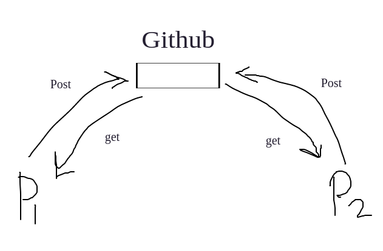

# Github

### The problem was facing without GitHub:
1. Sharing the code
2. versionig(Controlling the versions it's difficult)
3. Merging code

#### solution with Github
1. **Sharing the code:**
  - if two more people want to share there code and collaborate for the project, they will do with GitHub.
  - GitHub stored the code and give the chance to implement this code when they want and give the same authority for all they will have access
  <!--  -->
  <!--  -->
  

   
    
2. **versionig:**
 - If we want to mantain applications with version of code and feature.
 - It's done with github, Github maintain a code with a commits
 img

3. **Merging code:**
 - If two or more people work on same project we need to marge it and exchange the new changes as well.
 - GitHub also take care of this feature, GitHub maintain the code and allow to get the code in your local and post back.
 img

### For this feature, GitHub have own rules:
- install Git -> Install my software in your project
- commits -> when your project ready to save make commits for save this perticular project
- push -> after commit and you want to push this code on server for the record make
- pull -> when some one code pushed on Github, you want to update this code in your local to. so, pull it and add your local too.

### general commands:
1. a utility tool to review and read a history of everything that happens to a repository.
    > git log

2. inialize for git folder with the this command: this command created a folder that's a created by git by default
    > git init
    
3. git commit -a. Commit a snapshot of all changes in the working directory.
       > git commit
   - A shortcut command that immediately creates a commit with a passed commit message.
       >  git commit -m "commit message"

4. displays the state of the working directory and the staging area.
    > git status

5. Show changes between commits, commit and working tree, etc
    > git diff

6. adds a change in the working directory to the staging area. It tells Git that you want to include updates to a particular file in the next commit. 
    > git add .

7. You typically configure your global username and email address after installing Git.
   - Set your username
       > git config --global user.name "FIRST_NAME LAST_NAME"
   - Set your email address
       > git config --global user.email "MY_NAME@example.com"

8. used to upload local repository content to a remote repository
     > git push
   - push your code into the master branch
     > git push origin

9. In order to hard reset to the commit right before HEAD, use “git reset” with the “–hard” option and specify HEAD^.(deleted the previous commit).
  > git reset --hard "COMMIT_ID"

10. 
  > git clone

### branching command
1. creating a branch and checkout on created branch(checkout for switch and -b for create a new branch)
   > git checkout -b "branchName"

*There are 4 type of branching*
  *i release: Release branches are used for release task and long-term maintenance of software versions.*
  *ii hotfix: Maintenance or “hotfix” branches are used to quickly patch production releases. Hotfix branches are a lot like release branches and feature branches except they're based on main instead of develop.*
  *iii feature: A feature branch is a temporary branch used for development or testing purposes.*
  *iv bug: branches for bug fixes that are going into a planned upcoming release should be in feature branches.* 

2. To merge branches locally, use git checkout to switch to the branch you want to merge into. This branch is typically the main branch. Next, use git merge and specify the name of the other branch to bring into this branch.
   > git merge "branch_name"
   - after the marging need commit
   > git commit 

3. 
   > git fetch origin "BRANCH_NAME"

- gitHub
- gitLab
- bitbucket

##### conflicts
 
Git can handle most merges on its own with automatic merging features. A conflict arises when two separate branches have made edits to the same line in a file, or when a file has been deleted in one branch but edited in the other. Conflicts will most likely happen when working in a team environment.
 
   img

<<<<<<<<<<<<<
*the older code*
=============
*new changes are override*
>>>>>>>>>>>>>>

